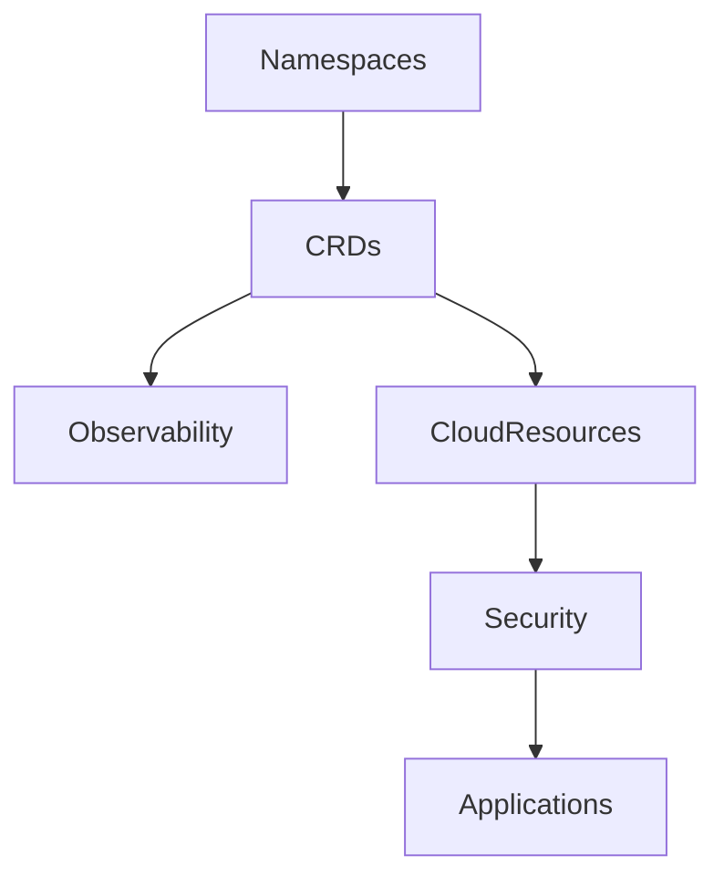
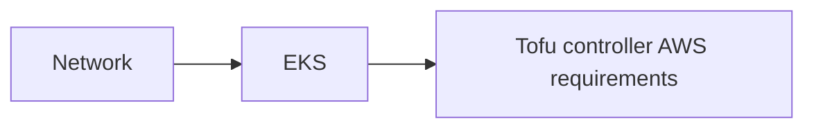

# Demo Opentofu Controller

ℹ️ [Blog post written in 2022](https://blog.ogenki.io/post/terraform-controller/)

🚧 _The second part is being written and will be soon available ..._.

This repository is dedicated to showcasing the **Flux Opentofu Controller**, a tool designed to bridge the gap between Kubernetes and cloud resource management. By leveraging the power and the flexibility of Opentofu modules, the Flux Controller enables seamless management of cloud infrastructure directly from within a Kubernetes cluster. Set within an Amazon EKS cluster, this demonstration provides a hands-on example of deploying the tofu-controller and configuring it to manage resources effectively. The core configurations and examples reside in `infrastructure/controlplane-0/tofu-controller`.

## 🔄 Flux Dependencies matter



This diagram can be hard to understand so these are the key information:

* **Namespaces** are the first resources to be created, all other resources may be namespace scoped
* **CRDs** that allow to extend Kubernetes capabilities must be present in order to use them in all other applications when needed (Including Tofu controller CRDs)
* **Cloud resources** may be required by applications. For instance the [EPI](https://docs.aws.amazon.com/eks/latest/userguide/pod-identities.html) give permissions to AWS services.
* **Security** defines `external-secrets` that are needed by some applications in order to start.

## 🚀 Deploy the ControlPlane

### Tailscale Terraform Issue Workaround

Due to a known issue with Tailscale and Terraform integration as outlined in [Tailscale issue #182](https://github.com/tailscale/terraform-provider-tailscale/issues/182), the Access Control Lists (ACLs) must be imported manually before proceeding with the Terraform apply. This step ensures that the ACLs are properly recognized by Terraform's state management, avoiding conflicts or errors during the infrastructure deployment process.

#### Importing ACLs

First, navigate to the `terragrunt/network` directory where the Terraform network configuration is located. Use the following command to import the existing Tailscale ACLs into your Terraform state.

```console
cd terragrunt/network
terragrunt import --var-file variables.tfvars tailscale_acl.this acl
```

#### Deploying Infrastructure with Terragrunt

Once the ACLs are imported, you can proceed with deploying your infrastructure. The deployment includes three main modules as visualized below:



* **Network**: This module sets up the Virtual Private Cloud (VPC), subnets, and the [Tailscale subnet router](https://github.com/Smana/terraform-aws-tailscale-subnet-router) necessary for private connections within the infrastructure. For more information on configuring Tailscale in a VPC environment, refer to my [previous blog post on Tailscale](https://blog.ogenki.io/post/tailscale/).

* **EKS**: This module deploys an Elastic Kubernetes Service (EKS) cluster, configures Karpenter for efficient node provisioning, and bootstraps Flux for GitOps-based cluster management.

* **Tofu Controller AWS Requirements**: Sets up the required IAM permissions for the Tofu controller to manage AWS Cloud resources. It also involves the creation of a secret used by the "Branch Planner".

To deploy all modules and apply the configuration changes, use the following Terragrunt command:

```console
cd terragrunt/tofu-controller
terragrunt run-all apply
```

⚠️ **Gateway API** is used here, exposing services publicly for the demo. For production use cases, these platform tools should be accessed through a secure wire.

## 🧪 CI

2 things are checked

* The Opentofu code quality, conformance and security using [pre-commit-terraform](https://github.com/antonbabenko/pre-commit-terraform).
* The kustomize and Kubernetes conformance using kubeconform and building the kustomize configuration.

In order to run the CI checks locally just run the following command

ℹ️ It requires [task](https://taskfile.dev/installation/) to be installed

```console
 task check
```

The same tasks are run in `Github Actions`.
