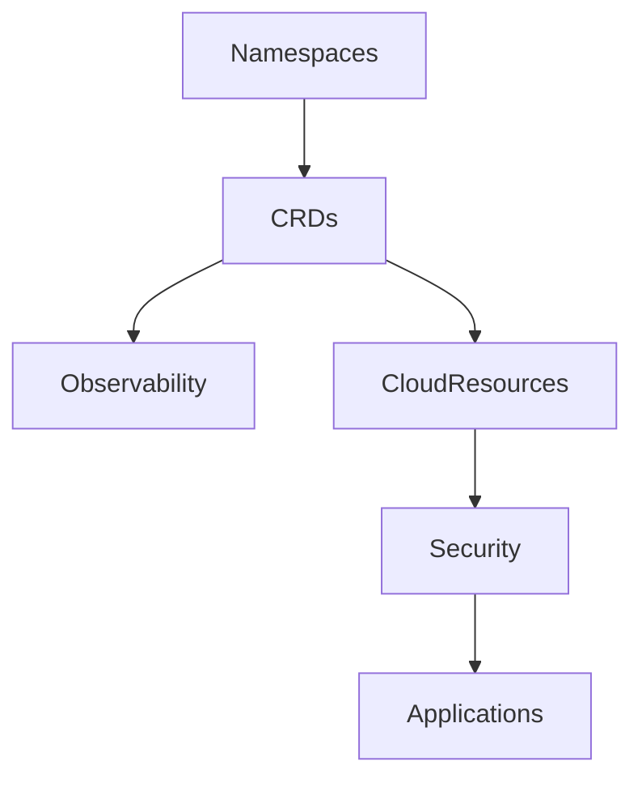
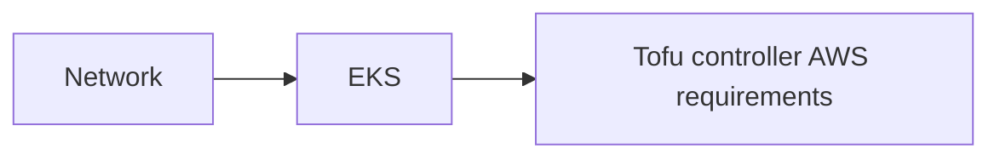

# Demo Opentofu Controller

[Here](https://blog.ogenki.io/post/tofu-controller/) is the related blog post

## 🔄 Flux Dependencies matter



This diagram can be hard to understand so these are the key information:

* **Namespaces** are the first resources to be created, all other resources may be namespace scoped
* **CRDs** that allow to extend Kubernetes capabilities must be present in order to use them in all other applications when needed (Including Tofu controller CRDs)
* **Cloud resources** may be required by applications. For instance the [EPI](https://docs.aws.amazon.com/eks/latest/userguide/pod-identities.html) give permissions to AWS services.
* **Security** defines `external-secrets` that are needed by some applications in order to start.

## 🚀 Deploy the ControlPlane

Due to this Tailscale [issue](https://github.com/tailscale/terraform-provider-tailscale/issues/182), the ACLs must be imported first

```console
cd terragrunt/network
terragrunt import --var-file variables.tfvars tailscale_acl.this acl
```

Then the following command will deploy 3 modules:



```console
terragrunt run-all apply
```


## 🧪 CI

2 things are checked

* The Opentofu code quality, conformance and security using [pre-commit-terraform](https://github.com/antonbabenko/pre-commit-terraform).
* The kustomize and Kubernetes conformance using kubeconform and building the kustomize configuration.

In order to run the CI checks locally just run the following command

ℹ️ It requires [task](https://taskfile.dev/installation/) to be installed

```console
 task check
```

The same tasks are run in `Github Actions`.
